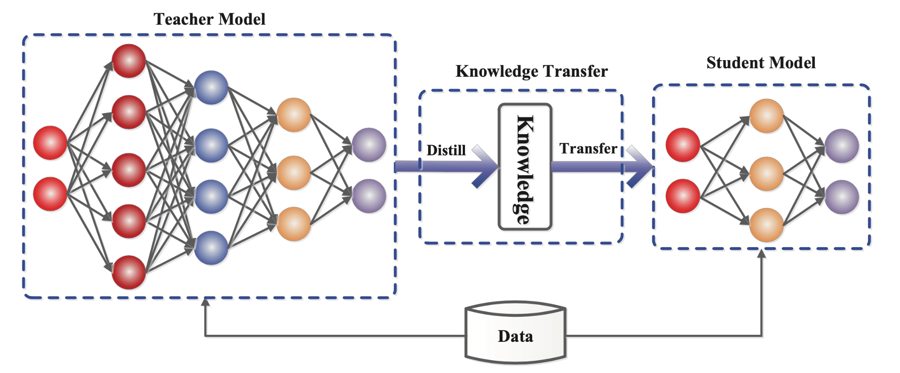

# KD_Leaf_Multiple_Students
## Project: Leaf Disease Detection using knowledge Distillation
The main objective of this project is developing a deep learning model for leaf disease detection that can be trained faster with higher accuracy using transfer learning where we will involve teacher-student architecture. The teacher model will be trained on a large dataset and its knowledge will be transferred to smaller student model to improve the accuracy. Our aim is to make an ensemble of student model which has learned from the teacher model.

   
 
 
 
 
## Major Objectives: 

1. Visualise the effect of transfer Learning and knowledge distillation. 
2. Understanding how a student network learns from the teacher model which can be taken as a powerful model. 
3. Give the student model very less data so that it use the knowledge of the teacher model. 
4. We will train the student model with less no of parameters. 
5. Making an ensemble of student networks which can learn from different teacher model and finding the application in the knowledge Distillation by transfer learning. 

## Approach (Give it a read):
The experiment aims to boost the performance of two student models using knowledge distillation, which involves transferring knowledge from a more complex teacher model to simpler student models. Soft targets generated by the teacher model are used to train the student models in addition to the hard targets of the dataset. This allows the student models to learn richer information and potentially improve their performance.

We will use DenseNet121 and Resnet101, two popular deep convolutional neural networks, as the teacher model in our leaf image classification experiment. The teacher model will be trained on a dataset for a large number of epochs to achieve high accuracy. We will use knowledge distillation to fine-tune the pre-trained model on this dataset.

Our objective is to use transfer learning and knowledge distillation to transfer the knowledge learned by the teacher model to the two selected student models, ShuffleNet and a custom-made CNN model consisting of 4 convolutional layers, which previously had poor performance. The student models will be trained on a smaller subset of the dataset with fewer epochs than the teacher model. By transferring knowledge, the student models can achieve higher accuracy in a shorter amount of time.

After training the ShuffleNet and custom-made CNN student models using knowledge distillation from the DenseNet121 and ResNet101 teacher models, we have four student models in total, which demonstrated improved performance compared to training them individually. Now, we want to do something which can increase the performance of these students and made them better.

To further enhance the performance of our student models, we can create an ensemble model by combining the predictions of the four student models. Ensemble learning has been shown to improve accuracy and robustness by leveraging the strengths of each individual model. The ensemble model can take the average prediction or use a more sophisticated technique like weighted averaging. In our experiment, the ensemble model made up of the four student models outperformed each individual student model that learned from their teacher model, proving the effectiveness of ensemble learning.

Class imbalance is a common problem in machine learning, where the number of examples in each class is not evenly distributed. Class imbalance can negatively affect neural network training by causing overfitting to majority classes and underfitting to minority classes. Synthetic Minority Over-sampling Technique (SMOTE) is a data augmentation technique that generates synthetic samples of the minority class by interpolating between existing samples. SMOTE helps balance class distributions in datasets, which can improve the neural network's ability to classify minority classes accurately.

In this experiment, SMOTE was applied to the imbalanced dataset to improve neural network performance during training and subsequently enhance the quality of the knowledge distillation process. The imbalanced-learn library in Python was used to implement SMOTE. After applying SMOTE, the resulting dataset had a more balanced class distribution, which was used to train the neural networks and perform knowledge distillation. The application of SMOTE led to improved results, which were recorded and analyzed. 
## Results:
Tacher: DenseNet
Without Smoteing:
| Model | Knowledge Distillation | Accuracy | Precision | Recall | F1 Score |
|-------|-----------------------|----------|-----------|--------|----------|
| Student Model 1 (DNET) | No | 0.53 | 0.56 | 0.46 | 0.46 |
| Student Model 1 (DNET) | Yes | 0.58 | 0.60 | 0.58 | 0.56 |
| Shuffle Net (Student Model 2) | No | 0.45 | 0.33 | 0.45 | 0.37 |
| Shuffle Net (Student Model 2) | Yes | 0.63 | 0.63 | 0.63 | 0.62 | 

With Smoteing: 

| Model | Knowledge Distillation | Accuracy | Precision | Recall | F1 Score |
|-------|-----------------------|----------|-----------|--------|----------|
| Student Model 1 (DNET) | No | 0.53 | 0.57 | 0.51 | 0.51 |
| Student Model 1 (DNET) | Yes | 0.68 | 0.68 | 0.67 | 0.68 |
| Shuffle Net (Student Model 2) | No | 0.58 | 0.64 | 0.58 | 0.59 |
| Shuffle Net (Student Model 2) | Yes | 0.64 | 0.69 | 0.64 | 0.66 |

Tacher: Resnet
Without Smoteing:

| Model | Knowledge Distillation | Accuracy | Precision | Recall | F1 Score |
|-------|-----------------------|----------|-----------|--------|----------|
| Student Model 4 (RNET) | No | 0.53 | 0.56 | 0.53 | 0.50 |
| Student Model 4 (RNET) | Yes | 0.59 | 0.62 | 0.59 | 0.57 |
| Shuffle Net (Student Model 3) | No | 0.41 | 0.30 | 0.42 | 0.34 |
| Shuffle Net (Student Model 3) | Yes | 0.63 | 0.61 | 0.63 | 0.61 |

With Smoteing:

| Model | Knowledge Distillation | Accuracy | Precision | Recall | F1 Score |
|-------|-----------------------|----------|-----------|--------|----------|
| Student Model 4 (RNET) | No | 0.54 | 0.63 | 0.55 | 0.55 |
| Student Model 4 (RNET) | Yes | 0.61 | 0.63 | 0.59 | 0.57 |
| Shuffle Net (Student Model 3) | No | 0.53 | 0.61 | 0.52 | 0.52 |
| Shuffle Net (Student Model 3) | Yes | 0.62 | 0.67 | 0.62 | 0.63 |
